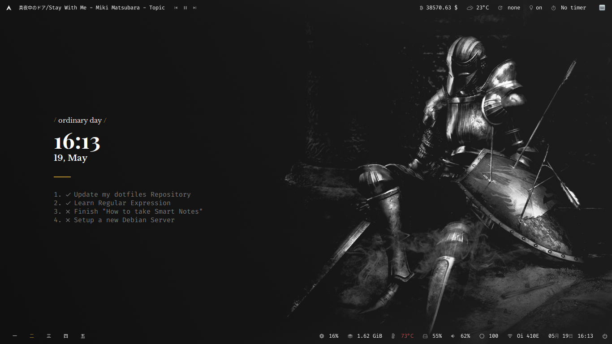
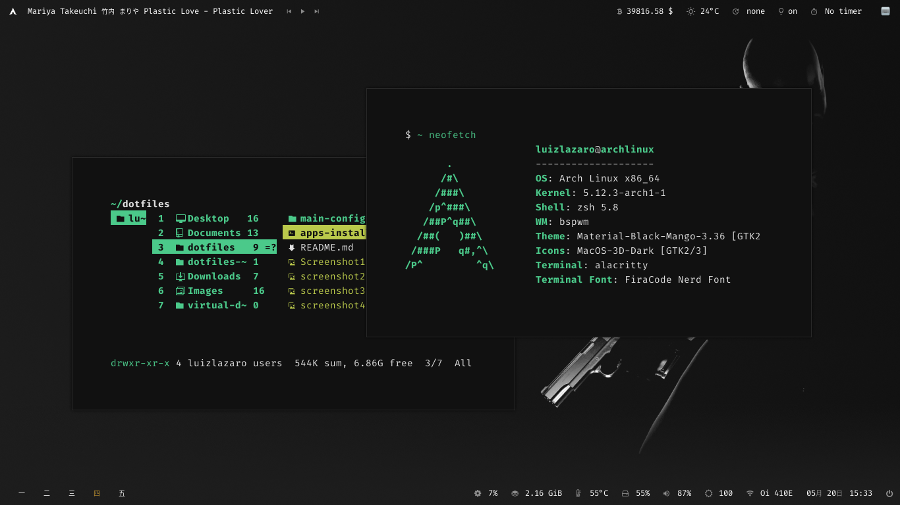
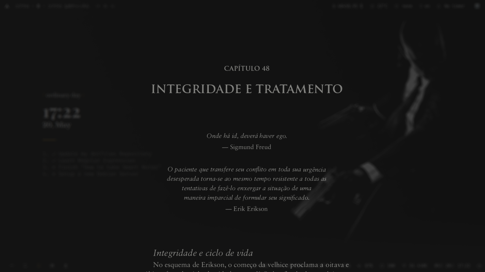
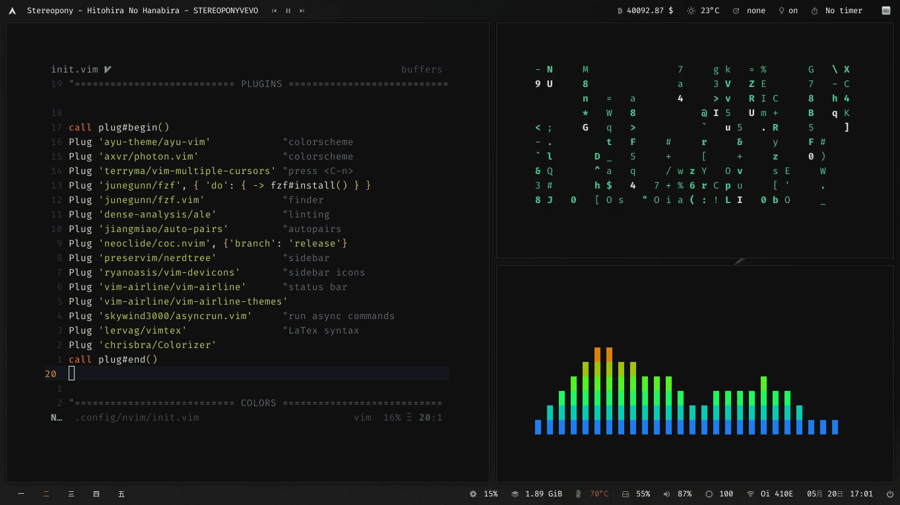

<br>
<p align="center">
My dotfiles :)
</p>
<br>

||  |
|:-:|:-:|

|||
|:-:|:-:|

<br>
<div align="center">

|:black_heart:|[Recommended Resizable Wallpapers](https://www.figma.com/file/mNR4G0Y7PjVfmSoWmKOOCu/Wallpapers?node-id=0%3A1)|:black_heart:|
|-|-|-|

</div>

# Installation

**1. Install** [Stow](https://github.com/aspiers/stow/).

```bash
sudo pacman -S stow
```
**2. Clone the repo**

```bash
git clone https://github.com/LuizLazaro/dotfiles.git && cd dotfiles
```

**3. Create the symlink**

```bash
stow -vt ~ main-config
```

:warning: | Stow does not replace your files, so in case of conflicts because it already exists, just delete the file you don't want or run the command bellow to replace the repository files by yours.
:-: | :---

```bash
stow --adopt -vt ~ main-config
```

# Remove

```bash
stow -Dvt ~ main-config
```

<p align="center">I hope you like it!</p>
<p align="center">:hearts:</p>
